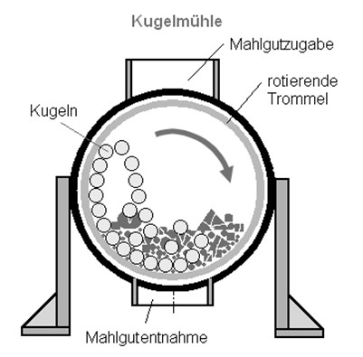

# Dashboard Operatives Produktionsmanagement

Excel-Dashboard zur Analyse von Werkzeugverschleiß, Prozessstabilität und Ausschusskosten in der keramischen Produktion.

Das Projekt demonstriert exemplarisch, wie Produktions- und Qualitätsdaten zur Unterstützung operativer Entscheidungen visualisiert und analysiert werden können.

# Projektziel

In der Herstellung keramischer Mahlmedien unterliegen Pressformen einem kontinuierlichen Verschleiß. Mit zunehmender Standzeit verschlechtert sich die Formgenauigkeit der produzierten Kugeln.

Dies kann zu:
- Qualitätsverlust
- instabilen Prozesseigenschaften
- erhöhtem Energiebedarf
- zusätzlichem Ausschuss
- steigenden Produktionskosten

führen.

Ziel des Dashboards ist die datenbasierte Unterstützung der Entscheidung, wann ein Werkzeug wirtschaftlich sinnvoll gewechselt werden sollte.

---

# Monitoring-Logik

## 1. Geometrische Toleranz

Überwachung der Abweichung von der idealen Kugelform.

Die Entwicklung der Messwerte visualisiert den fortschreitenden Werkzeugverschleiß.

---

## 2. Prozessstabilität

Analyse der Durchmesserverteilung der produzierten Kugeln.

Eine zunehmende Streuung weist auf sinkende Prozessstabilität hin.

---

## 3. Wirtschaftliche Bewertung

Vergleich zwischen:
- Ausschusskosten
- Kosten eines Werkzeugwechsels

Dadurch wird sichtbar, ab welchem Zeitpunkt ein Werkzeugwechsel wirtschaftlich sinnvoll ist.

---

# Technischer Hintergrund

## Kugelmühlen

Kugelmühlen dienen der Zerkleinerung und Homogenisierung von Mahlgut. Die rotierende Trommel enthält Mahlkörper, die das Material mechanisch zerkleinern.

Als Mahlkörper können keramische Kugeln aus Steinzeug verwendet werden.

Quelle: Wikipedia – Kugelmühle

---

## Herstellungsprozess

Die keramische Masse wird plastisch aufbereitet und anschließend mit Pressformen zu Kugeln verarbeitet.

Durch den Verschleiß der Formen verschlechtert sich mit der Zeit die Rundheit der Kugeln, was sich negativ auf Prozessqualität und Energieeffizienz auswirkt.

---

# Datenbasis

Die im Dashboard verwendeten Produktions- und Qualitätsdaten wurden zu Demonstrations- und Analysezwecken exemplarisch mit Excel generiert.

Die Daten simulieren typische Entwicklungen wie:
- zunehmenden Werkzeugverschleiß
- steigende Streuung
- Ausschussentwicklung
- wirtschaftliche Auswirkungen im Produktionsprozess

---

# Technologien

- Microsoft Excel
- Pivot-Tabellen
- Diagramme und Kennzahlenvisualisierung
- Simulierte Produktions- und Qualitätsdaten

---

# Projektkontext

Dieses Projekt wurde als Portfolio- und Lernprojekt im Rahmen der Umschulung zum Fachinformatiker für Daten- und Prozessanalyse erstellt.

Der fachliche Hintergrund basiert auf Erfahrungen aus Materialtechnik und Produktionsumfeld.

---

# Inhalte des Repositories

- Excel-Dashboard als .xlsx und als Screenshot
- Schematische Darstellung einer Kugelmühle
- Dokumentation des fachlichen Hintergrunds

---

# Ziel des Projekts

Das Projekt dient der Demonstration:
- datenbasierter Prozessanalyse
- operativer Kennzahlenvisualisierung
- technischer Problemmodellierung
- strukturierter Aufbereitung komplexer Produktionszusammenhänge
