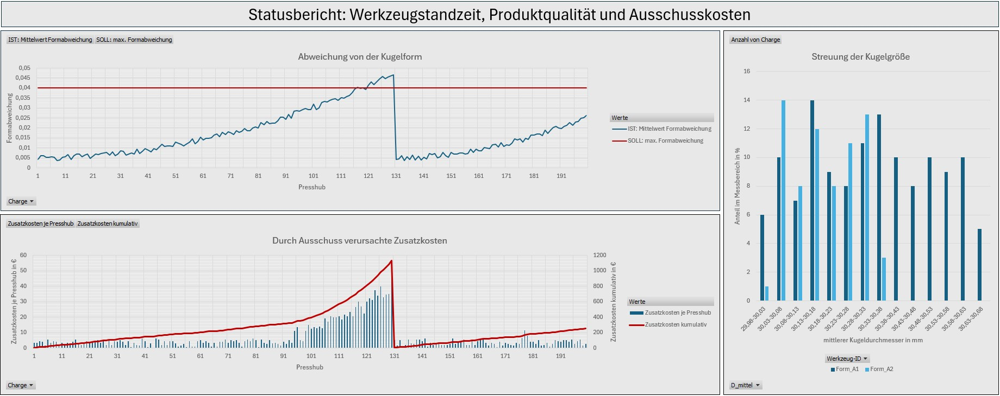

## Aufgabenstellung
Im Rahmen des Unterrichts im Fach Data-DL wird ein Dashboard erstellt werden, dass dem operativen Management eines Unternehmens bei der Optimierung von Geschäftsprozessen oder betriebsrelevanten Größen als Entscheidungshilfe dient.
Als Datengrundlage dienen frei verfügbare oder KI-generierte Daten verwendet werden. Ein Anwendungsfall soll konkret und eindeutig sein. Es sollen keine Filter oder Bedienelemente enthalten sein.

## Executive Summary: Prozessoptimierung der Herstellung von Mahlkugeln aus Steinzeug
### Anwendungsbereich:
Herstellung von keramischen Mahlmedien für Kugelmühlen mittels plastischer Formgebung.
### Problemstellung:
Die hochabrasive Steinzeugmasse führt zu einem progressiven Verschleiß der Pressformen. Mit zunehmender Standzeit (d.h. mehr Presshüben) erhöht sich die Unrundheit der Kugeln. In der Kugelmühle resultiert dies in einer instabilen Rollbewegung, erhöhtem Energiebedarf und ungleichmäßigem Abrieb des Mahlguts. Deshalb müssen zu unrunde Kugeln aussortiert und der Tonaufbereitung wieder zugeführt werden und verursachen dadurch zusätzliche Kosten. Entsprechend muss bei zu großem Verschleiß die Form gewechselt werden. Der Formwechsel kostet Geld und Zeit, ebenso die Aufbereitung der verschlissenen Form bzw. deren Neukauf. 
### Monitoring-Logik des Dashboards:
•	Abweichung von der Kugelform: Überwachung der geometrischen Toleranz. Die Kurve zeigt den Verschleißverlauf am Werkzeug.

•	Streuung der Kugelgröße: Statistische Auswertung der Durchmesserverteilung. Ein breiter werdender Glockenboden signalisiert den Verlust der Prozessstabilität (Form_A1).

•	Durch Ausschuss verursachte Zusatzkosten: Es wird erkennbar, wann die Kosten durch mangelhafte Qualität die Kosten eines Werkzeugwechsels übersteigen.

## Technischer Hintergrund
### Funktion einer Kugelmühle
Kugelmühlen dienen der Zerkleinerung und Homogenisierung von Mahlgut. Dieses befindet sich in der rotierenden Trommel zusammen mit den Mahlkörpern, durch die es zertrümmert wird.
Als Mahlkörper können Kugeln aus Steinzeug verwendet werden. Steinzeug ist ein natürlicher Rohstoff, bieten eine ausreichend hoher Härte und Festigkeit und sind vergleichsweise kostengünstig. 

Quelle: https://de.wikipedia.org/wiki/Kugelm%C3%BChle

### Herstellung der Kugeln
Der aus einer Tongrube gewonnene Rohstoff wird zunächst zu einer plastischen Masse aufbereitet. Diese wird unter Druck zu einem Strang gepresst, der in Abständen abgeschnitten wird. Die Abschnitte werden sodann in einer Metallform zu Kugeln gepresst. Danach müssen sie noch getrocknet und gebrannt werden.
